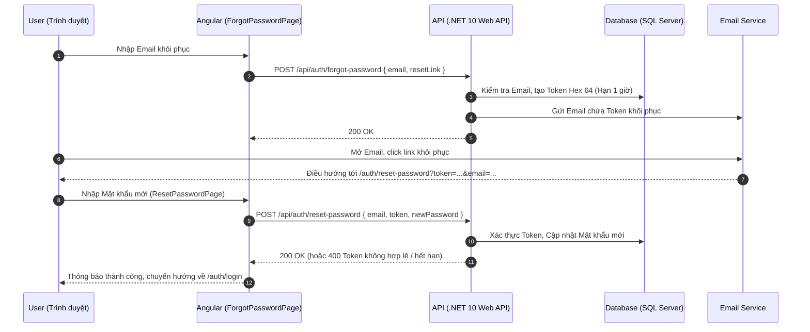

# 🧪 ShareLab — Shared Lab & Equipment Booking System

> **Nền tảng quản lý và đặt lịch phòng thí nghiệm, thiết bị dùng chung dành cho các tổ chức giáo dục & nghiên cứu.**

[](https://dotnet.microsoft.com/)
[](https://angular.dev/)
[](https://tailwindcss.com/)
[](https://www.typescriptlang.org/)
[](LICENSE)
[](https://github.com/)

---

## 📖 Giới thiệu (Overview)

**ShareLab** giúp Sinh viên, Giảng viên, Quản lý Lab, Kỹ thuật viên và Quản trị viên đặt lịch sử dụng phòng thí nghiệm và thiết bị dùng chung trên một nền tảng thống nhất — giúp tối ưu hoá tần suất sử dụng, loại bỏ xung đột lịch trùng, theo dõi trạng thái thiết bị theo thời gian thực và minh bạch hoá quy trình vận hành.

Hệ thống được thiết kế theo kiến trúc hiện đại:
- **Backend:** .NET 10 Web API chuẩn **Clean Architecture** sử dụng mẫu **CQRS** (MediatR), Entity Framework Core 10 (SQL Server), bảo mật bằng **JWT Bearer**.
- **Frontend:** **Angular 22 Standalone Components**, tận dụng **Angular Signals**, **Reactive Forms**, **Tailwind CSS v4** và đa ngôn ngữ tức thời qua **ngx-translate**.

---

## ✨ Tính năng nổi bật (Key Features)

- 🔐 **Xác thực JWT & Phân quyền đa vai trò** — Quản lý truy cập theo vai trò (`Student`, `Lecturer`, `Lab Manager`, `Technician`, `Administrator`).
- 🔑 **Quên / Đặt lại mật khẩu an toàn** — Luồng khôi phục tài khoản qua email chứa link kèm Token ngẫu nhiên (Hex 64 ký tự), tự động hết hạn sau 1 giờ.
- 🛡️ **Chính sách Mật khẩu Fluent & 2 Lớp** — Đảm bảo mật khẩu mạnh thông qua bộ kiểm tra xích (Fluent API Validation) ở Client và `UserService` ở Server.
- 📅 **Đặt phòng & Thiết bị thông minh** — Tra cứu trạng thái rảnh/bận theo thời gian thực, đặt chỗ theo khung giờ linh hoạt, ngăn ngừa việc đặt trùng lặp.
- 📊 **Thống kê & Dashboard trực quan** — Theo dõi chỉ số hoạt động, tần suất đặt chỗ và hiệu suất khai thác thiết bị.
- 🌐 **Đa ngôn ngữ (i18n)** — Hỗ trợ Tiếng Việt (`vi`) và Tiếng Anh (`en`), chuyển đổi ngôn ngữ tức thời.
- 🎨 **Giao diện hiện đại & Linh hoạt** — Thiết kế Tailwind CSS v4 Responsive (Mobile-first), thành phần UI chuẩn mực SaaS.

---

## 🏗️ Kiến trúc & Công nghệ (Architecture & Tech Stack)

### Tech Stack Chi Tiết

| Tầng | Công nghệ & Thư viện |
|---|---|
| **Backend API** | .NET 10, ASP.NET Core Web API, Entity Framework Core 10 |
| **Backend Architecture** | Clean Architecture (`Domain` → `Application` → `Infrastructure` → `API`), CQRS với MediatR, AutoMapper, FluentValidation, Swashbuckle (Swagger) |
| **Frontend Framework** | Angular 22 (Standalone Components, Angular Signals, RxJS, Reactive Forms) |
| **Giao diện & UI** | Tailwind CSS v4, Custom Design Tokens, CSS Paged Media |
| **Đa ngôn ngữ (i18n)** | `@ngx-translate/core` + `@ngx-translate/http-loader` (`vi`, `en`) |
| **Testing & Scripting** | Vitest, Node.js Automation Scripts (`open-browser.js`), Docker & Nginx |

---

### 🔒 Quy tắc bảo mật Mật khẩu (Password Security Policy)

Hệ thống áp dụng chính sách kiểm tra mật khẩu 2 lớp chặt chẽ:

| Điều kiện kiểm tra | Client (`FluentPasswordPolicy`) | Server (`UserService.ValidatePassword`) |
|---|:---:|:---:|
| **Độ dài tối thiểu** | `> 8` ký tự (từ 9 ký tự trở lên) | `≥ 8` ký tự |
| **Ký tự in hoa (A-Z)** | ✅ Bắt buộc | ✅ Bắt buộc |
| **Ký tự in thường (a-z)** | ✅ Bắt buộc | ✅ Bắt buộc |
| **Chữ số (0-9)** | ✅ Bắt buộc | ✅ Bắt buộc |
| **Ký tự đặc biệt (`!@#$%^&*...`)** | ✅ Bắt buộc | ⛔ Không bắt buộc |

> **Lưu ý:** Client áp dụng bộ lọc Fluent Validation nghiêm ngặt hơn Server nhằm đảm bảo mọi mật khẩu hợp lệ ở Client đều vượt qua kiểm tra từ phía Server.

---

### 🔁 Luồng xử lý Quên / Đặt lại mật khẩu (Password Reset Flow)



---

## 📁 Cấu trúc thư mục dự án (Project Structure)

```text
sharelab/
├── public/                     # Static Assets & Files i18n
│   ├── i18n/                   # File dịch thuật đa ngôn ngữ (en.json, vi.json)
│   └── favicon.ico
├── scripts/                    # Automation Scripts
│   ├── config.js               # Cấu hình địa chỉ Client Local
│   └── open-browser.js         # Tự động mở trình duyệt khi khởi chạy
├── src/                        # Angular Frontend App
│   ├── app/
│   │   ├── core/               # Auth, Interceptors, Config, Guards, Stores
│   │   │   ├── auth/           # AuthService, AuthStore, FluentPasswordValidator, TokenStorage
│   │   │   ├── config/         # Environment App configurations
│   │   │   └── http/           # ApiError, AuthInterceptor, ErrorInterceptor
│   │   ├── features/           # Feature Modules (Pages & Components)
│   │   │   ├── auth/           # Login, Forgot-Password, Reset-Password pages
│   │   │   ├── dashboard/      # Dashboard sau đăng nhập
│   │   │   ├── home/           # Landing Page (Hero, About, Feature, Workflow, Statistics, Preview, CTA)
│   │   │   ├── users/          # Quản lý tài khoản người dùng
│   │   │   └── not-found/      # Trang 404
│   │   └── shared/             # Components UI tái sử dụng (Button, Card, Logo, Layouts)
│   ├── environments/           # File cấu hình môi trường Development/Production
│   ├── main.ts                 # Entry point Angular App
│   └── styles.css              # Global styles & Tailwind CSS setup
├── SharedLabAndEquipmentBookingSystem/ # Backend API (.NET 10 Clean Architecture)
│   ├── Domain/                 # Entities, Enums, Value Objects
│   ├── Application/            # CQRS Commands/Queries, Services, Interfaces, DTOs
│   ├── Infrastructure/         # EF DbContext, Repositories, JWT Services, Email Sender
│   └── API/                    # ASP.NET Core Web API Controllers, Middlewares, Program.cs
├── Dockerfile                  # Cấu hình Docker build cho Frontend/Backend
├── nginx.conf                  # Cấu hình Web Server Nginx cho Production deployment
├── package.json
└── README.md

```

---

## 🚀 Hướng dẫn Cài đặt & Chạy dự án (Getting Started)

### Yêu cầu môi trường (Prerequisites)

* [.NET SDK 10.0+](https://dotnet.microsoft.com/download)
* [Node.js 20+](https://nodejs.org/) & `npm 11+`
* SQL Server (LocalDB / Express / Docker Container)
* Angular CLI: `npm install -g @angular/cli`

---

### 1. Clone Dự án

```bash
git clone https://github.com/<your-org>/sharelab.git
cd sharelab

```

---

### 2. Cấu hình & Khởi chạy Backend (.NET 10 API)

1. Di chuyển vào thư mục Backend:
```bash
cd SharedLabAndEquipmentBookingSystem

```


2. Cập nhật chuỗi kết nối Database & cấu hình JWT trong file `appsettings.Development.json`:
```json
{
  "ConnectionStrings": {
    "DefaultConnection": "Server=localhost;Database=ShareLabDb;Trusted_Connection=True;TrustServerCertificate=True;"
  },
  "Jwt": {
    "Key": "YOUR_SUPER_SECRET_KEY_WITH_AT_LEAST_256_BITS_LENGTH",
    "Issuer": "ShareLabAPI",
    "Audience": "ShareLabClient"
  }
}

```


3. Cập nhật Database và chạy API:
```bash
dotnet restore
dotnet ef database update
dotnet run

```


> 📍 **Backend API:** `https://localhost:7073`
> 📄 **Swagger UI:** `https://localhost:7073/swagger`


---

### 3. Cấu hình & Khởi chạy Frontend (Angular 22)

1. Mở cửa sổ Terminal mới tại thư mục gốc của dự án (`sharelab/`).
2. Kiểm tra file cấu hình môi trường `src/environments/environment.development.ts`:
```typescript
export const environment = {
  production: false,
  apiBaseUrl: 'https://localhost:7073/api',
  defaultLocale: 'vi',
  supportedLocales: ['vi', 'en'] as const,
}

```


3. Cài đặt các thư viện phụ thuộc và chạy ứng dụng Angular:
```bash
npm install
npm start

```


> 🌐 **Frontend Application:** `http://localhost:4200`


---

## 🛠️ Lệnh Script Hỗ trợ (NPM Scripts)

| Lệnh Script | Mô tả |
| --- | --- |
| `npm start` | Chạy Angular Dev Server (`ng serve`) |
| `npm run build` | Build ứng dụng cho môi trường Production |
| `npm run test` | Chạy Unit Test với Vitest |
| `node scripts/open-browser.js` | Tự động mở ứng dụng trên trình duyệt mặc định |

---

## 🐳 Triển khai với Docker (Deployment)

Dự án cung cấp sẵn `Dockerfile` và `nginx.conf` hỗ trợ đóng gói và triển khai ứng dụng bằng Container:

```bash
# Build Docker Image cho Frontend
docker build -t sharelab-frontend .

# Chạy Container trên cổng 80
docker run -d -p 80:80 --name sharelab-app sharelab-frontend

```

---

## 🤝 Quy trình Đóng góp (Contributing Guidelines)

1. **Tạo nhánh (Branch):**
* Tính năng mới: `feature/<ten-tinh-nang>`
* Sửa lỗi: `fix/<ten-loi>`


2. **Quy chuẩn Commit:** Độc lập theo chuẩn [Conventional Commits](https://www.conventionalcommits.org/):
* `feat:` Tính năng mới
* `fix:` Sửa lỗi
* `refactor:` Cải tiến cấu trúc mã nguồn
* `docs:` Cập nhật tài liệu


3. Tạo **Pull Request (PR)** kèm mô tả chi tiết và gắn mã Issue tương ứng.

---

## 📄 Giấy phép (License)

Dự án được phát hành theo giấy phép open-source **[MIT License](https://www.google.com/search?q=LICENSE)**.
